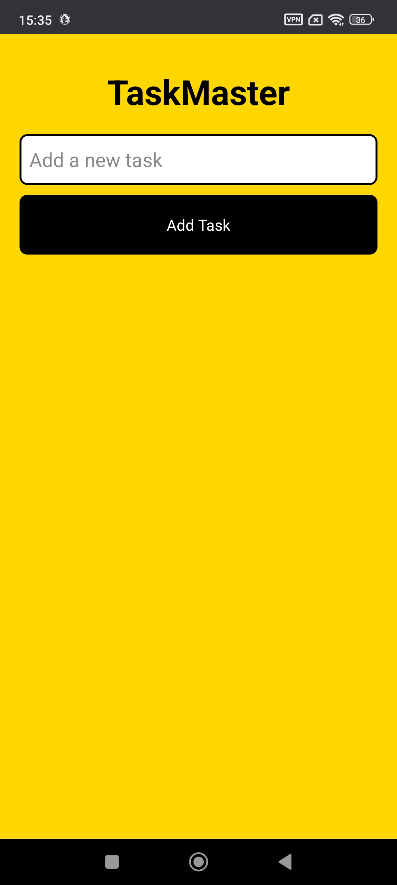
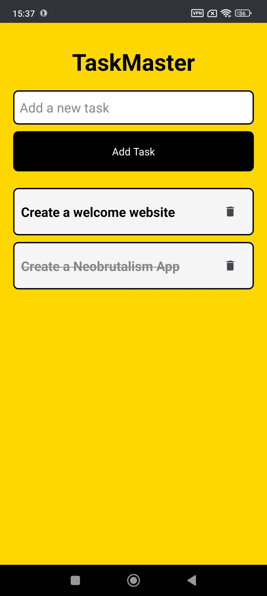

[](https://choosealicense.com/licenses/mit/)
---
# :star: TaskManager
A vibrant and modern task manager app inspired by the NeoBrutalism design trend. This project was created to train and practice React Native development skills, making it perfect for anyone looking to organize their tasks with a unique and bold visual style.

# :camera: Screenshots





# :sparkles: Features
- Add new tasks with ease
- Mark tasks as completed
- Delete tasks
- Persistent storage using AsyncStorage
- NeoBrutalism-inspired UI with bold colors and typography

# :hammer_and_wrench: Stack used

**Front-end:** React Native, Expo, React Native Paper

**Back-end:** None (Client-side storage using AsyncStorage)


# :package: Prerequisites
```bash
npm install @react-native-async-storage/async-storage react-native-paper react-native-vector-icons
```
    
# :books: Reference
[Expo Documentation](https://docs.expo.dev/)

[AsyncStorage Documentation](https://docs.expo.dev/versions/latest/sdk/async-storage/)

[React Native Paper Documentation](https://callstack.github.io/react-native-paper/)

# :busts_in_silhouette: Authors
- [@imbiel-dev](https://www.github.com/imbiel-dev)